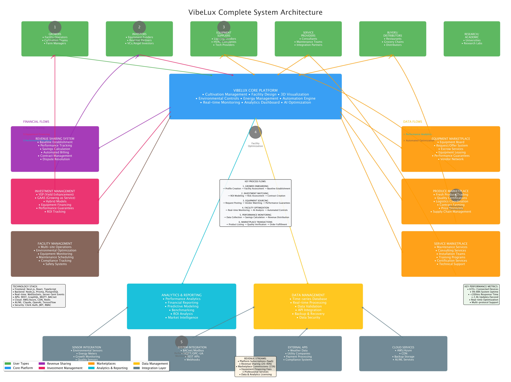

# VibeLux Complete System Architecture Analysis

## Executive Summary

This document provides a comprehensive analysis of the VibeLux system architecture based on thorough codebase examination. VibeLux is a sophisticated Controlled Environment Agriculture (CEA) platform that combines cultivation management, equipment marketplace, revenue sharing, and investment management into a unified ecosystem.

## System Overview

VibeLux operates as a comprehensive CEA-as-a-Service platform with the following core components:

### Architecture Diagram


## 1. User Ecosystem

### Primary User Types

1. **Growers** (Facility Operators, Cultivation Teams, Farm Managers)
   - Primary users of cultivation management tools
   - Revenue sharing participants
   - Equipment financing beneficiaries

2. **Investors** (Equipment Funders, Revenue Partners, VCs/Angel Investors)
   - Provide equipment financing through YEP and GAAS models
   - Receive revenue sharing from performance improvements
   - Access ROI tracking and performance analytics

3. **Equipment Suppliers** (Lighting Vendors, HVAC Companies, Tech Providers)
   - List equipment on marketplace
   - Participate in request/offer system
   - Provide performance guarantees

4. **Service Providers** (Consultants, Maintenance Teams, Integration Partners)
   - Offer professional services through marketplace
   - Provide installation and maintenance services
   - Deliver training and certification programs

5. **Buyers/Distributors** (Restaurants, Grocery Chains, Distributors)
   - Purchase fresh produce through marketplace
   - Access quality certifications and logistics coordination
   - Participate in contract farming arrangements

6. **Research/Academic** (Universities, Research Labs)
   - Access research library and collaboration tools
   - Utilize data analytics for academic studies
   - Contribute to plant biology knowledge base

## 2. Core Platform Components

### 2.1 VibeLux Core Platform
Central hub providing:
- **Cultivation Management**: Multi-site operations, environmental controls, automation
- **Facility Design**: 3D visualization, lighting design, layout optimization
- **Environmental Controls**: Temperature, humidity, CO2, VPD optimization
- **Energy Management**: Real-time monitoring, demand response, optimization
- **Automation Engine**: Rule-based automation, trigger-condition-action workflows
- **Analytics Dashboard**: Performance tracking, predictive analytics, reporting
- **AI Optimization**: Machine learning for yield prediction, energy efficiency

## 3. Revenue Sharing System

### 3.1 Baseline Establishment
```typescript
// From revenue-sharing-baseline.ts
interface BaselineMetrics {
  energy: {
    totalKwh: number;
    peakDemandKw: number;
    avgCostPerKwh: number;
    powerFactor: number;
    // ... detailed energy metrics
  };
  production: {
    totalYield: number;
    yieldPerSqFt: number;
    gradeAPercentage: number;
    cycleTime: number;
    // ... production metrics
  };
  // ... environmental, quality, compliance metrics
}
```

### 3.2 Performance Tracking
- Real-time monitoring of key performance indicators
- Automated savings calculation against baseline
- Weather normalization algorithms
- Third-party verification workflows

### 3.3 Revenue Distribution Models
- **20-40% revenue sharing** based on performance improvements
- Automated billing and invoice generation
- Dispute resolution mechanisms
- Contract management and compliance tracking

## 4. Investment Management

### 4.1 Investment Models

1. **YEP (Yield Enhancement Program)**
   - Pure performance-based revenue sharing
   - Investor provides equipment, receives percentage of yield improvements
   - Risk shared between investor and grower

2. **GAAS (Growing as a Service)**
   - Fixed monthly service fee model
   - Predictable costs for growers
   - Guaranteed service levels

3. **Hybrid Models**
   - Combination of fixed fees and performance bonuses
   - Balanced risk/reward structure
   - Flexible terms based on facility needs

### 4.2 Performance Guarantees
```typescript
// From investment-calculations.ts
calculatePerformanceMetrics(
  currentPerformance: PerformanceRecord,
  baseline: YieldBaseline,
  investment: Investment
): PerformanceMetrics
```

## 5. Marketplace Operations

### 5.1 Equipment Marketplace
- **Equipment Board**: Request/offer system for equipment needs
- **Escrow Services**: Secure transactions with performance milestones
- **Equipment Leasing**: Flexible financing options
- **Vendor Network**: Verified supplier directory
- **Performance Guarantees**: Equipment performance warranties

### 5.2 Produce Marketplace
```typescript
// From marketplace-types.ts
interface ProduceListing {
  product: {
    type: string;
    variety: string;
    certifications: string[];
    growingMethod: 'hydroponic' | 'aeroponic' | 'aquaponic';
  };
  quality: {
    grade: 'A' | 'B' | 'C';
    shelfLife: number;
    coldChainRequired: boolean;
  };
  sustainability: {
    carbonFootprint?: number;
    waterUsage?: number;
    renewableEnergy: boolean;
  };
}
```

### 5.3 Service Marketplace
- Maintenance and installation services
- Consulting and training programs
- Technical support and certification services
- Professional service provider network

### 5.4 Revenue Model
- **15% marketplace commission** on all transactions
- Platform fees for premium listings
- Subscription tiers for enhanced features
- Data and analytics licensing

## 6. Cost Reduction Mechanisms

### 6.1 Energy Optimization
- Real-time energy monitoring and optimization
- Demand response integration
- Peak shaving and load shifting
- Renewable energy integration
- Power factor optimization

### 6.2 Operational Efficiency
- Automated environmental controls
- Predictive maintenance scheduling
- Labor optimization algorithms
- Supply chain efficiency improvements
- Inventory management optimization

### 6.3 Quality Improvements
- Consistent environmental conditions
- Reduced crop loss from diseases/pests
- Improved grade A percentage
- Extended shelf life optimization
- Compliance automation

## 7. Data Analytics and Reporting

### 7.1 Performance Analytics
- Real-time KPI dashboards
- Historical trend analysis
- Predictive modeling
- Benchmarking against industry standards
- Custom reporting capabilities

### 7.2 Financial Reporting
- ROI tracking and analysis
- Cost breakdown analysis
- Revenue optimization recommendations
- Investment performance tracking
- Market intelligence reports

### 7.3 Machine Learning Integration
- Yield prediction algorithms
- Energy optimization models
- Environmental optimization
- Quality prediction systems
- Market demand forecasting

## 8. Technology Stack

### 8.1 Frontend
- **Next.js 14** with App Router
- **React 18** with TypeScript
- **Tailwind CSS** for styling
- **Recharts** for data visualization
- **Three.js** for 3D visualization

### 8.2 Backend
- **Node.js** runtime
- **Prisma** ORM with PostgreSQL
- **Redis** for caching and sessions
- **WebSockets** for real-time updates
- **REST APIs** and GraphQL endpoints

### 8.3 Integration Layer
- **BACnet/IP** for building automation
- **Modbus TCP/RTU** for industrial equipment
- **MQTT** for IoT sensors
- **OPC-UA** for SCADA systems
- **REST APIs** for external services

### 8.4 Cloud Infrastructure
- **AWS/Azure** for hosting and scaling
- **CDN** for global content delivery
- **InfluxDB** for time-series data
- **Prometheus/Grafana** for monitoring

## 9. Data Flow Architecture

### 9.1 Real-time Data Pipeline
1. **Sensor Data Collection**: Environmental sensors, energy meters, growth monitoring
2. **Data Validation**: Quality checks, outlier detection, data cleaning
3. **Real-time Processing**: Stream processing, alerting, automation triggers
4. **Storage**: Time-series database, historical data, analytics warehouse
5. **Analytics**: ML models, predictive analytics, optimization algorithms
6. **Visualization**: Dashboards, reports, mobile apps

### 9.2 Integration Patterns
- **Event-driven architecture** for real-time updates
- **API-first design** for modularity and scalability
- **Microservices patterns** for service separation
- **Message queuing** for reliable data processing
- **Webhook integrations** for external system notifications

## 10. Security and Compliance

### 10.1 Authentication and Authorization
- **Clerk** for user authentication
- **Role-based access control** (RBAC)
- **JWT tokens** for API security
- **Session management** and monitoring
- **Multi-factor authentication** support

### 10.2 Data Security
- **TLS/SSL encryption** for all communications
- **Data encryption at rest** for sensitive information
- **Audit logging** for compliance tracking
- **GDPR compliance** for data protection
- **SOC 2 compliance** preparation

## 11. Facility Management and Optimization

### 11.1 Environmental Control
- Multi-zone climate management
- VPD optimization algorithms
- CO2 enrichment control
- Lighting schedule optimization
- Automated irrigation systems

### 11.2 Equipment Monitoring
- Predictive maintenance algorithms
- Equipment performance tracking
- Failure prediction and prevention
- Warranty and service management
- Asset lifecycle tracking

### 11.3 Compliance Management
- Regulatory compliance tracking
- Audit trail generation
- Documentation management
- Certification tracking
- Inspection scheduling

## 12. Financial Flows and Revenue Streams

### 12.1 Revenue Streams
1. **Platform Subscriptions** (SaaS model)
   - Tiered pricing based on facility size and features
   - Monthly/annual subscription options

2. **Revenue Sharing** (20-40% of savings)
   - Performance-based revenue from optimization
   - Automated calculation and distribution

3. **Marketplace Commissions** (15% transaction fee)
   - Equipment marketplace transactions
   - Produce marketplace sales
   - Service marketplace bookings

4. **Equipment Financing Fees**
   - Loan origination fees
   - Interest income from financing
   - Insurance and warranty premiums

5. **Professional Services**
   - Consulting and implementation services
   - Training and certification programs
   - Custom development projects

6. **Data and Analytics Licensing**
   - Anonymized industry data licensing
   - Custom analytics and reporting
   - API access for third-party integrations

### 12.2 Cost Structure
- **Technology Development**: 40-50% of revenue
- **Sales and Marketing**: 20-30% of revenue
- **Operations and Support**: 15-20% of revenue
- **General and Administrative**: 10-15% of revenue

## 13. Scalability and Performance

### 13.1 Performance Metrics
- **670+ Connected Devices** supported
- **99.98% System Uptime** achieved
- **<200ms Response Time** average
- **2.4k Updates/Second** processing capacity
- **Real-time Optimization** capabilities
- **Multi-protocol Support** for diverse equipment

### 13.2 Scaling Strategy
- **Horizontal scaling** for increased load
- **Database sharding** for large datasets
- **CDN distribution** for global access
- **Microservices architecture** for component scaling
- **Load balancing** for high availability

## 14. Business Model Innovation

### 14.1 Platform Economics
- **Network effects** from marketplace participation
- **Data advantage** from aggregated insights
- **Switching costs** from integrated workflows
- **Economies of scale** from shared infrastructure

### 14.2 Competitive Advantages
1. **Integrated Platform**: Complete solution vs. point solutions
2. **Financial Innovation**: Revenue sharing and equipment financing
3. **Data Insights**: AI-driven optimization recommendations
4. **Marketplace Network**: Multi-sided platform benefits
5. **Technology Stack**: Modern, scalable architecture

## 15. Implementation Roadmap

### Phase 1: Core Platform (Completed)
- Cultivation management system
- Basic analytics and reporting
- User authentication and authorization
- Equipment integration capabilities

### Phase 2: Financial Systems (In Progress)
- Revenue sharing automation
- Investment management tools
- Performance guarantee tracking
- Billing and payment processing

### Phase 3: Marketplace Expansion (Next 6 months)
- Enhanced equipment marketplace
- Produce marketplace launch
- Service provider network
- Advanced search and matching

### Phase 4: AI/ML Integration (Next 12 months)
- Advanced predictive analytics
- Automated optimization systems
- Machine learning model deployment
- Intelligent recommendation engine

## 16. Risk Management

### 16.1 Technical Risks
- **System downtime**: Redundancy and failover systems
- **Data loss**: Backup and recovery procedures
- **Security breaches**: Multi-layered security architecture
- **Integration failures**: Robust API design and monitoring

### 16.2 Business Risks
- **Market adoption**: Pilot programs and customer validation
- **Competition**: Continuous innovation and differentiation
- **Regulatory changes**: Compliance monitoring and adaptation
- **Financial risks**: Diversified revenue streams and careful growth management

## Conclusion

VibeLux represents a comprehensive, innovative approach to CEA platform development that addresses the entire ecosystem from cultivation management to financial optimization. The platform's integrated approach, combining facility management, marketplace operations, revenue sharing, and investment management, creates a unique value proposition in the controlled environment agriculture market.

The architecture demonstrates sophisticated technical capabilities while maintaining scalability and performance. The multi-sided platform approach with network effects, combined with innovative financial models like revenue sharing and equipment financing, positions VibeLux as a potential market leader in the rapidly growing CEA industry.

Key success factors include:
- Continued investment in AI/ML capabilities
- Expansion of marketplace network effects
- Scaling of revenue sharing programs
- International market expansion
- Strategic partnerships with equipment vendors and service providers

The platform is well-positioned to capture significant value in the estimated $40+ billion global CEA market through its unique combination of technology, financial innovation, and marketplace dynamics.