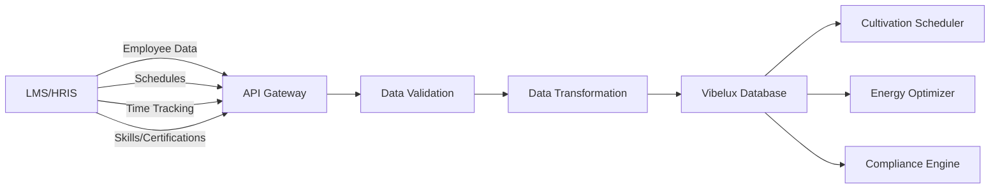
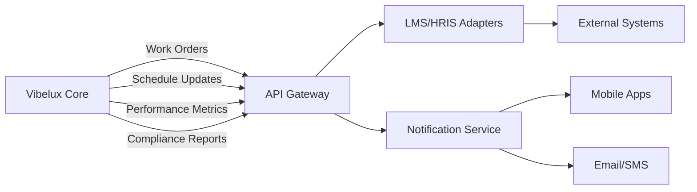

# Labor Management Systems Integration Architecture

## Overview
This document outlines the technical architecture for integrating Vibelux with existing Labor Management Systems (LMS) and Human Resource Information Systems (HRIS) used in cultivation facilities.

## Business Requirements

### Core Integration Needs
- **Work Order Management**: Automatically generate work orders based on cultivation schedules and plant health data
- **Labor Optimization**: Schedule workers based on crop cycles, environmental conditions, and energy optimization
- **Compliance Tracking**: Track labor hours for regulatory compliance and audit trails
- **Skill-Based Scheduling**: Match worker skills with specific cultivation tasks
- **Performance Analytics**: Correlate labor efficiency with crop outcomes and energy usage

### Key Stakeholders
- **Cultivation Managers**: Need integrated scheduling and task management
- **HR Departments**: Require compliance tracking and performance metrics
- **Operations Teams**: Need real-time labor allocation and work order execution
- **Finance Teams**: Cost tracking and labor expense optimization

## Integration Architecture

### 1. API Gateway Pattern
```
Vibelux Core Platform
├── Labor Management API Gateway
│   ├── Authentication/Authorization Service
│   ├── Data Transformation Layer
│   ├── Rate Limiting & Throttling
│   └── Audit Logging
├── Integration Adapters
│   ├── BambooHR Adapter
│   ├── ADP Workforce Now Adapter
│   ├── Kronos/UKG Adapter
│   ├── Deputy Adapter
│   ├── When I Work Adapter
│   └── Generic REST/SOAP Adapter
└── Event Processing Engine
    ├── Work Order Generation
    ├── Schedule Optimization
    └── Notification Service
```

### 2. Data Flow Architecture

#### Inbound Data Flows


#### Outbound Data Flows


## Technical Specifications

### 3. Database Schema Extensions

#### Employee Management Tables
```sql
-- Employee profiles with cultivation-specific skills
CREATE TABLE cultivation_employees (
    id UUID PRIMARY KEY DEFAULT gen_random_uuid(),
    external_employee_id VARCHAR(255) UNIQUE, -- ID from external LMS
    lms_system VARCHAR(100) NOT NULL, -- 'bamboohr', 'adp', 'kronos', etc.
    
    -- Basic Info (synced from LMS)
    employee_number VARCHAR(100),
    first_name VARCHAR(255) NOT NULL,
    last_name VARCHAR(255) NOT NULL,
    email VARCHAR(255),
    phone VARCHAR(255),
    department VARCHAR(255),
    position VARCHAR(255),
    
    -- Cultivation-Specific Data
    cultivation_skills TEXT[], -- Array of skill codes
    certifications TEXT[], -- Pesticide applicator, etc.
    security_clearance_level VARCHAR(50),
    preferred_shifts TEXT[], -- 'day', 'night', 'weekend'
    
    -- Status
    status VARCHAR(50) DEFAULT 'active', -- 'active', 'inactive', 'terminated'
    hire_date DATE,
    termination_date DATE,
    
    -- Sync tracking
    last_sync_at TIMESTAMP WITH TIME ZONE,
    sync_status VARCHAR(50) DEFAULT 'synced', -- 'synced', 'pending', 'error'
    
    created_at TIMESTAMP WITH TIME ZONE DEFAULT NOW(),
    updated_at TIMESTAMP WITH TIME ZONE DEFAULT NOW()
);

-- Work orders generated from cultivation schedules
CREATE TABLE cultivation_work_orders (
    id UUID PRIMARY KEY DEFAULT gen_random_uuid(),
    facility_id UUID NOT NULL REFERENCES facilities(id),
    
    -- Work Order Details
    title VARCHAR(255) NOT NULL,
    description TEXT,
    work_order_type VARCHAR(100) NOT NULL, -- 'irrigation', 'pruning', 'harvest', etc.
    priority VARCHAR(50) DEFAULT 'medium', -- 'low', 'medium', 'high', 'urgent'
    
    -- Scheduling
    scheduled_start TIMESTAMP WITH TIME ZONE,
    scheduled_end TIMESTAMP WITH TIME ZONE,
    estimated_hours DECIMAL(6,2),
    required_skills TEXT[],
    min_workers INTEGER DEFAULT 1,
    max_workers INTEGER,
    
    -- Location
    zone_id UUID REFERENCES cultivation_zones(id),
    room_id UUID REFERENCES cultivation_rooms(id),
    specific_location TEXT,
    
    -- Assignment
    assigned_to UUID[] REFERENCES cultivation_employees(id)[],
    assigned_by UUID REFERENCES cultivation_employees(id),
    
    -- Status Tracking
    status VARCHAR(50) DEFAULT 'pending', -- 'pending', 'assigned', 'in_progress', 'completed', 'cancelled'
    actual_start TIMESTAMP WITH TIME ZONE,
    actual_end TIMESTAMP WITH TIME ZONE,
    completion_notes TEXT,
    
    -- Integration
    external_work_order_id VARCHAR(255), -- ID in external LMS
    sync_status VARCHAR(50) DEFAULT 'pending', -- 'pending', 'synced', 'error'
    
    created_at TIMESTAMP WITH TIME ZONE DEFAULT NOW(),
    updated_at TIMESTAMP WITH TIME ZONE DEFAULT NOW()
);

-- Labor scheduling integration
CREATE TABLE labor_schedules (
    id UUID PRIMARY KEY DEFAULT gen_random_uuid(),
    employee_id UUID NOT NULL REFERENCES cultivation_employees(id),
    facility_id UUID NOT NULL REFERENCES facilities(id),
    
    -- Schedule Details
    shift_date DATE NOT NULL,
    shift_start TIME NOT NULL,
    shift_end TIME NOT NULL,
    break_duration_minutes INTEGER DEFAULT 30,
    
    -- Schedule Source
    schedule_source VARCHAR(100), -- 'vibelux_auto', 'external_lms', 'manual'
    external_schedule_id VARCHAR(255),
    
    -- Work Assignment
    assigned_zones UUID[] REFERENCES cultivation_zones(id)[],
    assigned_work_orders UUID[] REFERENCES cultivation_work_orders(id)[],
    special_instructions TEXT,
    
    -- Optimization Context
    energy_optimization_factor DECIMAL(5,2), -- How much energy optimization influenced this schedule
    crop_cycle_priority VARCHAR(50), -- 'flowering', 'harvest', 'transplant', etc.
    
    -- Status
    status VARCHAR(50) DEFAULT 'scheduled', -- 'scheduled', 'confirmed', 'cancelled', 'completed'
    actual_clock_in TIMESTAMP WITH TIME ZONE,
    actual_clock_out TIMESTAMP WITH TIME ZONE,
    
    -- Sync
    last_sync_at TIMESTAMP WITH TIME ZONE,
    sync_status VARCHAR(50) DEFAULT 'pending',
    
    created_at TIMESTAMP WITH TIME ZONE DEFAULT NOW(),
    updated_at TIMESTAMP WITH TIME ZONE DEFAULT NOW()
);

-- Performance tracking
CREATE TABLE labor_performance_metrics (
    id UUID PRIMARY KEY DEFAULT gen_random_uuid(),
    employee_id UUID NOT NULL REFERENCES cultivation_employees(id),
    work_order_id UUID REFERENCES cultivation_work_orders(id),
    
    -- Time Period
    period_start TIMESTAMP WITH TIME ZONE NOT NULL,
    period_end TIMESTAMP WITH TIME ZONE NOT NULL,
    
    -- Performance Metrics
    tasks_completed INTEGER DEFAULT 0,
    efficiency_score DECIMAL(5,2), -- 0-100%
    quality_score DECIMAL(5,2), -- 0-100%
    safety_incidents INTEGER DEFAULT 0,
    
    -- Cultivation-Specific Metrics
    plants_processed INTEGER,
    yield_contribution_lbs DECIMAL(10,3),
    energy_efficiency_improvement DECIMAL(8,4), -- kWh saved per hour worked
    
    -- Correlation Data
    crop_health_impact DECIMAL(5,2), -- How this work affected crop health
    environmental_compliance BOOLEAN DEFAULT TRUE,
    
    created_at TIMESTAMP WITH TIME ZONE DEFAULT NOW()
);
```

### 4. Integration Adapters

#### BambooHR Integration
```typescript
interface BambooHRAdapter {
  // Employee synchronization
  syncEmployees(): Promise<EmployeeSyncResult>
  getEmployee(employeeId: string): Promise<BambooEmployee>
  updateEmployee(employeeId: string, data: EmployeeUpdate): Promise<void>
  
  // Time tracking
  getTimeOffRequests(startDate: Date, endDate: Date): Promise<TimeOffRequest[]>
  submitTimeEntry(entry: TimeEntry): Promise<void>
  
  // Reporting
  generateLaborReport(params: ReportParams): Promise<LaborReport>
}

class BambooHRService implements BambooHRAdapter {
  private apiKey: string
  private subdomain: string
  
  async syncEmployees(): Promise<EmployeeSyncResult> {
    const employees = await this.fetchAllEmployees()
    const syncResults = await Promise.all(
      employees.map(emp => this.syncEmployeeData(emp))
    )
    
    return {
      total: employees.length,
      synced: syncResults.filter(r => r.success).length,
      errors: syncResults.filter(r => !r.success)
    }
  }
  
  private async fetchAllEmployees(): Promise<BambooEmployee[]> {
    const response = await fetch(`https://api.bamboohr.com/api/gateway.php/${this.subdomain}/v1/employees/directory`, {
      headers: {
        'Authorization': `Basic ${Buffer.from(this.apiKey + ':x').toString('base64')}`,
        'Accept': 'application/json'
      }
    })
    
    return response.json()
  }
}
```

#### ADP Workforce Now Integration
```typescript
interface ADPAdapter {
  // Authentication
  authenticate(): Promise<ADPToken>
  refreshToken(): Promise<ADPToken>
  
  // Employee data
  getWorkers(filters?: WorkerFilters): Promise<ADPWorker[]>
  getWorkerSchedules(workerId: string, dateRange: DateRange): Promise<Schedule[]>
  
  // Time and attendance
  submitTimeCard(timeCard: TimeCard): Promise<void>
  getTimeCards(filters: TimeCardFilters): Promise<TimeCard[]>
}

class ADPService implements ADPAdapter {
  private clientId: string
  private clientSecret: string
  private token?: ADPToken
  
  async authenticate(): Promise<ADPToken> {
    const response = await fetch('https://accounts.adp.com/auth/oauth/v2/token', {
      method: 'POST',
      headers: {
        'Content-Type': 'application/x-www-form-urlencoded',
        'Authorization': `Basic ${Buffer.from(this.clientId + ':' + this.clientSecret).toString('base64')}`
      },
      body: 'grant_type=client_credentials&scope=api'
    })
    
    this.token = await response.json()
    return this.token
  }
}
```

### 5. Work Order Generation Engine

```typescript
class WorkOrderGenerator {
  async generateWorkOrdersFromCultivationSchedule(
    facilityId: string,
    dateRange: DateRange
  ): Promise<WorkOrder[]> {
    const cropSchedules = await this.getCropSchedules(facilityId, dateRange)
    const environmentalData = await this.getEnvironmentalForecast(facilityId, dateRange)
    const laborAvailability = await this.getLaborAvailability(facilityId, dateRange)
    
    const workOrders: WorkOrder[] = []
    
    for (const schedule of cropSchedules) {
      // Generate irrigation work orders
      if (schedule.needsIrrigation) {
        workOrders.push(await this.createIrrigationWorkOrder(schedule))
      }
      
      // Generate pruning work orders
      if (schedule.needsPruning) {
        workOrders.push(await this.createPruningWorkOrder(schedule))
      }
      
      // Generate harvest work orders
      if (schedule.readyForHarvest) {
        workOrders.push(await this.createHarvestWorkOrder(schedule))
      }
      
      // Generate maintenance work orders
      const maintenanceTasks = await this.calculateMaintenanceNeeds(schedule, environmentalData)
      workOrders.push(...maintenanceTasks)
    }
    
    // Optimize work orders based on labor availability and energy optimization
    return this.optimizeWorkOrderScheduling(workOrders, laborAvailability)
  }
  
  private async optimizeWorkOrderScheduling(
    workOrders: WorkOrder[],
    laborAvailability: LaborAvailability
  ): Promise<WorkOrder[]> {
    // Apply energy optimization constraints
    const energyOptimizedOrders = await this.applyEnergyOptimization(workOrders)
    
    // Balance workload across available labor
    const balancedOrders = await this.balanceLaborLoad(energyOptimizedOrders, laborAvailability)
    
    // Prioritize based on crop health and deadlines
    return this.prioritizeWorkOrders(balancedOrders)
  }
}
```

### 6. Real-Time Synchronization

#### Event-Driven Architecture
```typescript
interface LaborManagementEventBus {
  // Employee events
  onEmployeeUpdated(employeeId: string, handler: EmployeeEventHandler): void
  onEmployeeScheduleChanged(employeeId: string, handler: ScheduleEventHandler): void
  
  // Work order events
  onWorkOrderCompleted(workOrderId: string, handler: WorkOrderEventHandler): void
  onWorkOrderAssigned(workOrderId: string, handler: AssignmentEventHandler): void
  
  // System events
  onSyncError(system: string, handler: ErrorEventHandler): void
}

class LaborEventProcessor {
  constructor(private eventBus: LaborManagementEventBus) {
    this.setupEventHandlers()
  }
  
  private setupEventHandlers(): void {
    // When work order is completed, update external LMS
    this.eventBus.onWorkOrderCompleted('*', async (event) => {
      await this.updateExternalLMS(event.workOrderId, 'completed')
      await this.calculatePerformanceMetrics(event.workOrderId)
      await this.updateCropHealthMetrics(event.workOrderId)
    })
    
    // When employee schedule changes in external system, update Vibelux
    this.eventBus.onEmployeeScheduleChanged('*', async (event) => {
      await this.syncScheduleChanges(event.employeeId, event.scheduleData)
      await this.reoptimizeWorkOrders(event.facilityId)
    })
  }
}
```

## Implementation Phases

### Phase 1: Core Infrastructure (Month 1-2)
- [ ] API Gateway setup with authentication
- [ ] Database schema implementation
- [ ] Basic employee synchronization
- [ ] Work order generation framework

### Phase 2: Primary Integrations (Month 3-4)
- [ ] BambooHR adapter implementation
- [ ] ADP Workforce Now adapter
- [ ] Real-time synchronization engine
- [ ] Basic work order automation

### Phase 3: Advanced Features (Month 5-6)
- [ ] Labor optimization algorithms
- [ ] Performance analytics dashboard
- [ ] Mobile app integration
- [ ] Compliance reporting automation

### Phase 4: Additional Integrations (Month 7-8)
- [ ] Kronos/UKG adapter
- [ ] Deputy adapter
- [ ] When I Work adapter
- [ ] Generic REST/SOAP adapter for custom systems

## Security & Compliance

### Data Protection
- **Encryption**: All employee data encrypted at rest and in transit
- **Access Control**: Role-based access with principle of least privilege
- **Audit Logging**: Complete audit trail of all data access and modifications
- **Data Retention**: Configurable retention policies for compliance

### Compliance Features
- **SOX Compliance**: Financial controls for labor cost tracking
- **GDPR/CCPA**: Employee data privacy and right to deletion
- **Industry Regulations**: Cannabis-specific compliance tracking
- **Labor Law Compliance**: Overtime tracking, break requirements, etc.

## Monitoring & Analytics

### Key Performance Indicators
- **Labor Efficiency**: Tasks completed per hour worked
- **Energy Correlation**: Labor cost vs. energy savings correlation
- **Crop Yield Impact**: Labor quality impact on harvest outcomes
- **Compliance Score**: Percentage of regulations met
- **Integration Health**: API uptime and sync success rates

### Dashboards
1. **Operations Dashboard**: Real-time labor allocation and work order status
2. **Performance Dashboard**: Individual and team performance metrics
3. **Compliance Dashboard**: Regulatory compliance tracking
4. **Cost Analysis Dashboard**: Labor cost optimization opportunities

## API Documentation

### RESTful Endpoints

#### Employee Management
```
GET /api/v1/labor/employees
POST /api/v1/labor/employees/sync
GET /api/v1/labor/employees/{id}
PUT /api/v1/labor/employees/{id}
```

#### Work Orders
```
GET /api/v1/labor/work-orders
POST /api/v1/labor/work-orders
GET /api/v1/labor/work-orders/{id}
PUT /api/v1/labor/work-orders/{id}/assign
POST /api/v1/labor/work-orders/{id}/complete
```

#### Scheduling
```
GET /api/v1/labor/schedules
POST /api/v1/labor/schedules/optimize
GET /api/v1/labor/schedules/employee/{id}
PUT /api/v1/labor/schedules/{id}
```

### WebSocket Events
```
employee.updated
employee.scheduled
workorder.created
workorder.assigned
workorder.completed
schedule.optimized
sync.error
```

## Testing Strategy

### Unit Testing
- Individual adapter functionality
- Work order generation algorithms
- Performance calculation logic
- Data transformation functions

### Integration Testing
- End-to-end synchronization flows
- External API connectivity
- Event processing pipelines
- Database integrity

### Performance Testing
- Large-scale employee synchronization
- High-frequency work order generation
- Real-time event processing
- API response times under load

## Deployment Architecture

### Production Environment
```
Load Balancer
├── API Gateway Cluster (3 nodes)
├── Integration Service Cluster (3 nodes)
├── Event Processing Cluster (2 nodes)
└── Database Cluster (Primary + 2 Replicas)

External Integrations
├── LMS/HRIS Systems
├── Message Queue (Redis/RabbitMQ)
└── Monitoring (Prometheus/Grafana)
```

### Scalability Considerations
- Horizontal scaling of API gateway and integration services
- Database read replicas for reporting queries
- Message queue for asynchronous processing
- CDN for static assets and documentation

## Cost Analysis

### Implementation Costs
- **Development**: 6-8 months, 3-4 developers
- **Infrastructure**: $5,000-10,000/month for production environment
- **Integration Licenses**: Varies by LMS provider
- **Maintenance**: 1-2 developers ongoing

### ROI Projections
- **Labor Efficiency Gains**: 15-25% improvement in task completion rates
- **Energy Cost Savings**: 5-10% additional savings through optimized scheduling
- **Compliance Cost Reduction**: 60-80% reduction in manual compliance tracking
- **Payback Period**: 12-18 months for typical facility